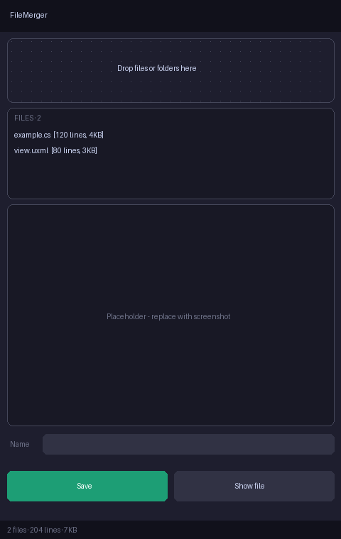

# FileMerger

Small, portable Windows tool that merges many text files into **one** text file — with a live preview of exactly what will be saved.

Handy for pasting a bunch of source files into an AI chat, a code review, or an issue in one go.

<p align="center"></p>

## Features
- **Add files your way:** drag & drop from Explorer, `Ctrl+V` files copied in Explorer, or click the drop zone to browse.
- **Folders** are added recursively (skips `.git`, `bin`, `obj`, `node_modules`, `.vs`); duplicates and binary files are skipped automatically.
- **Any text file** works — `.cs`, `.js`, `.json`, `.xml`, `.uxml`, `.uss`, `.html`, `.md`, … (UTF-8/UTF-16 with BOM, UTF-8, ANSI fallback).
- **Reorder** files by dragging rows; `Delete` removes the selection.
- **Live preview** with line numbers (AvalonEdit), stays smooth with large inputs.
- **Auto-name** output, e.g. `index.html+init.cs.txt`, or type your own; never overwrites (`name (1).txt`).
- **Save** (`Ctrl+S`) as UTF-8 without BOM, then **Show file** in Explorer.
- Dark / light theme follows Windows automatically; pin button = always on top.
- Portable: no installer, settings stored in `FileMerger.settings.json` next to the exe.

## Output format
```
###Files has been merged together with FileMerger###

###index.html [224 lines, 2KB]
<content of index.html>

###init.cs [200 lines, 10KB]
<content of init.cs>
```

## Download
Grab the latest build from [Actions](../../actions/workflows/build.yml) → newest green run → *Artifacts*:
- `FileMerger` — small single exe, requires [.NET 8 Desktop Runtime](https://dotnet.microsoft.com/download/dotnet/8.0).
- `FileMerger-selfcontained` — larger single exe, runs without any runtime installed.

## Build from source
Requires a .NET SDK 8 or newer (Windows for running; WPF compiles on Linux too).
```
dotnet build FileMerger.sln -c Release
dotnet test tests/FileMerger.Tests -c Release
dotnet publish src/FileMerger -c Release -p:PublishProfile=FrameworkDependent
```

Project rules and design notes live in [`AGENTS.md`](AGENTS.md) and [`docs/`](docs/).
